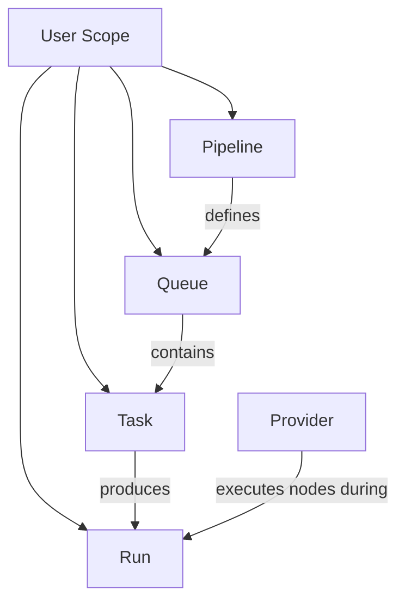
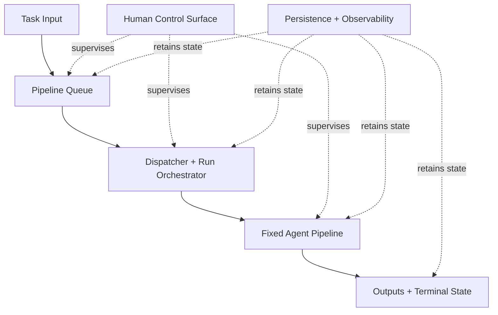
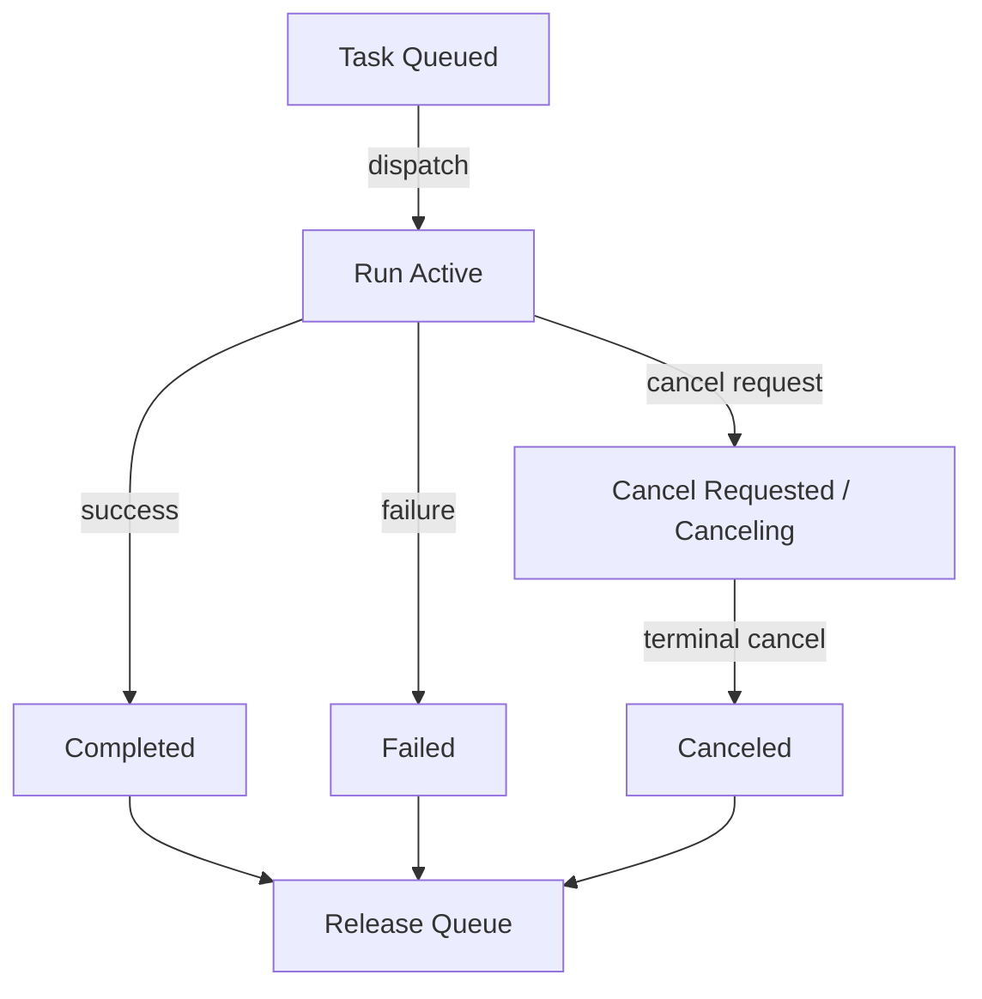
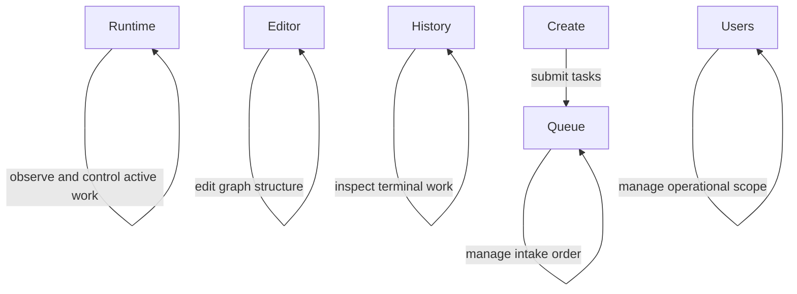

# AgentraLoop Architecture

## Overview

AgentraLoop is an agent-oriented runtime for continuous software work.

It is built around a simple idea:

- users submit **tasks**
- tasks enter **queues**
- queues dispatch **runs**
- runs execute fixed **pipelines**
- pipelines invoke concrete **agent providers**

This is intentionally different from model-centric chat software. The goal is not to keep a human in a live conversational loop for every step. The goal is to let bounded work run under explicit runtime control, with clear state, history, cancellation, and auditability.

In practice, AgentraLoop is designed for:

- software implementation
- code review
- queued development work
- multi-user isolated execution
- long-running, always-on service operation

## Why This Exists

Most AI products are still organized around chat. That works for:

- drafting
- explanation
- exploration
- quick one-off help

It works less well for continuous engineering work.

Real software work usually needs:

- explicit task intake
- queueing
- workflow structure
- cancellation and retry
- run history
- multi-user separation
- workspace ownership

Many current developer-agent tools improve on plain chat, but they still often follow a pattern like:

- one human
- one active session
- one continuously steered task

That is better than chat, but it still assumes a live operator loop. AgentraLoop is aimed at a different mode:

- queued work
- fixed orchestration
- runtime supervision
- unattended progress between human interventions

As models become more capable, the bottleneck shifts away from interactive prompting and toward:

- reliable task assignment
- runtime control
- operational supervision

## Execution Paradigms

### Execution paradigms

| Paradigm | Primary unit | Human role | Operational predictability | Suitability for 24x7 work |
| --- | --- | --- | --- | --- |
| Model-centric chat | turn | continuous steering | low; transcript carries most state | weak |
| Session-style developer agent | live session | one human steers one task | moderate; better tools, still session-bound | limited |
| Unconstrained multi-agent conversation | dialogue | operator cannot tightly bound progress | low; cost, duration, and responsibility drift | poor |
| Queue-driven agent runtime | task / run | supervision through control and audit | high; state transitions and task boundaries are explicit | strong |

## Problem Framing

Most deployed AI products still treat the model endpoint as the center of the application. The surrounding software is often a thin shell over prompt submission and streamed output. This design is natural when the primary user need is conversational interaction. It is much less effective when the target workload is a persistent operational process.

Examples include:

- queued engineering requests
- autonomous-but-supervised software maintenance
- batched review pipelines
- multi-user task services that must continue functioning whether or not a human is actively watching the screen

The weakness of the model-centric pattern is that it conflates user interaction with execution architecture. In chat products:

- context is often represented as a conversation transcript
- control is implicit in the next user message
- operational state is weakly formalized

These choices are convenient for interactive use, but they create friction for systems that need:

- explicit work intake
- deterministic task boundaries
- durable state transitions
- strong observability

A common response to the limitations of single-model chat is to introduce multiple agents that collaborate through free-form dialogue. This can create the appearance of autonomy, but it often fails as an engineering architecture.

When agents communicate without strong structural constraints:

- costs grow unpredictably
- termination becomes ambiguous
- responsibility boundaries blur
- operators may observe activity without knowing whether the system is progressing or merely extending the conversation

This creates two problems in the current landscape:

1. chat-style or session-style agent tools still require close one-to-one human supervision
2. unconstrained multi-agent orchestration creates large amounts of interaction whose cost, duration, and quality are difficult to bound

For production systems, that ambiguity is unacceptable. Tasks must begin at a known point, execute under explicit policy, and terminate in a state that can be audited. Inputs and outputs must be attributable to specific execution units. Cancellation must have a defined meaning. Historical records must be inspectable after the fact. Queue discipline matters, especially when the goal is to support 24x7 work intake without collapsing into uncontrolled background activity.

The target use case for AgentraLoop is **continuous, supervised, queue-driven task execution**. This imposes concrete requirements:

- persistent task intake
- serial queue semantics as a baseline
- human control over active work
- auditable history
- multi-user isolation
- tolerance for heterogeneous providers
- clean separation between queueing, orchestration, provider invocation, persistence, and operator interaction

## Core Position

The core engineering claim is simple: sustained AI productivity depends on architecture. Continuous AI work needs queue-driven orchestration, explicit runtime state, human-visible control, and provider-aware agent lifecycle management.

The problem can be stated as:

> How should an AI application be architected if its primary objective is not short-form conversation, but continuous, multi-step, multi-user, human-supervised task execution using programmable agents?

AgentraLoop answers this by shifting from model-centric design to agent-centric design. The application defines first-class:

- tasks
- queues
- pipelines
- runs
- providers

It also provides a human control surface that makes execution visible and interruptible without reducing the system to a chat transcript. Once a workflow is defined, the system should be able to continue processing queued work without requiring constant human presence.

The broader position is:

- users should increasingly work with agent runtimes rather than isolated model chats
- providers should increasingly expose integrated agent services selected by role, capability, and operational contract

## Design Principles

The architectural position is simple: modern AI software should be built for **agent use**, not merely for **model conversation**.

On the application side, users should submit tasks into agent-oriented runtimes rather than steer every step through chat. On the provider side, AI vendors should expose integrated agent services, including:

- lifecycle-aware SDKs
- session or thread semantics
- cancellation support
- structured execution metadata
- operational hooks suitable for software systems

In mature form, this means users should acquire specialized agent services by role, capability, and operational contract, not by repeatedly hand-assembling low-level model calls.

### Design principles

| Principle | Architectural implication | Operational benefit |
| --- | --- | --- |
| Agents as first-class execution units | agent invocation carries explicit state, provider identity, workspace, outputs, and lifecycle events | execution becomes observable, interruptible, and auditable |
| Pipelines as declarative coordination graphs | work decomposition is authored as an explicit node-and-edge program | stages such as planning, implementation, and review remain inspectable and reusable |
| Queues as the intake boundary | continuous work enters durable queue objects rather than endless chat sessions | intake remains serializable, reorderable, and governable |
| Human supervision through control surfaces | operators intervene at task, queue, run, and history boundaries rather than token loops | less conversational micromanagement and better operational oversight |
| Provider abstraction with lifecycle respect | SDK-backed and process-backed providers share orchestrator semantics without erasing backend differences | heterogeneous backends fit one runtime without flattening important control signals |
| Simplicity over speculative autonomy | orchestration remains bounded, queue-driven, and conservative | more predictable cost, progress, and termination behavior |

These principles define the practical direction of AgentraLoop: durable agent execution units, queue-based work intake, provider-aware lifecycle handling, and human-supervised operation.

## 4. System Model

The system model of AgentraLoop is built around six first-class objects:

- `User`
- `Pipeline`
- `Queue`
- `Task`
- `Run`
- `Provider`

The purpose of this model is not to create an abstract ontology for its own sake. Its purpose is to give continuous AI work a stable operational grammar. Each object exists because a continuous agent system must answer a concrete engineering question: what was requested, what should run next, what is running now, who owns the workspace, and which backend is actually executing the work.

| Object | Primary question | Architectural role |
| --- | --- | --- |
| User | Who owns this operational scope? | Isolates workspaces, data, logs, queues, tasks, and runs. |
| Pipeline | How is this work programmed? | Defines the fixed graph of agent nodes, edges, prompts, and providers. |
| Queue | What should run next? | Orders pending tasks and enforces serial intake policy for a pipeline. |
| Task | What work was requested? | Carries a bounded title and prompt as the queued unit of external work. |
| Run | What actually executed? | Records concrete execution state, node outputs, and terminal outcome. |
| Provider | Which backend performed the work? | Realizes node execution against a concrete agent service or toolchain. |

### System model relationships



The model is intentionally compact: a user owns operational scope, a pipeline defines a queue, tasks enter that queue, tasks produce runs, and providers execute the pipeline nodes inside those runs.

### Pipeline

A pipeline is a reusable workflow definition expressed as a directed graph of agent nodes and edges. Each node contains provider, model, and prompt configuration, while the edges define execution ordering and information flow. In this architecture, a pipeline is the unit of **programmed agent coordination**. It is not a transient prompt template and not an invisible internal chain. It is a persistent, editable artifact that can be validated, rendered, versioned, and reused.

### Queue

A queue is the intake and ordering mechanism associated with a pipeline. In the current design, one pipeline corresponds to one queue. The queue exists because continuous AI work needs a durable place where incoming requests can wait, be edited, be reordered, and be dispatched under explicit operational policy. Without a queue, the system falls back toward direct conversational triggering, which is precisely the mode this document argues against.

### Task

A task is the externally submitted unit of work. In the current implementation, tasks are text-only and consist primarily of:

- a title
- a prompt
- user scope
- queue membership
- ordering and status metadata

A task is not the same thing as a run. A task represents requested work before and during execution. This distinction matters, because a queue may contain many tasks, only one of which may currently be active.

### Run

A run is the concrete execution instance produced from a task or direct invocation. It binds together:

- a pipeline definition
- resolved runtime configuration
- provider invocations
- node outputs
- event history
- terminal outcome

Runs are the system's main execution object. If tasks answer the question *what was requested?*, then runs answer the question *what actually happened?*

### User

A user is an operational scope, not merely a login label. Users own separate workspaces, persisted data, logs, pipeline sets, queues, tasks, and runs. This model reflects the practical requirement that long-running AI work must remain isolated across users if the system is to support shared deployment or continuous service operation.

### Provider

A provider is the bridge between the orchestrator and a concrete agent backend. Providers translate generic node invocations into backend-specific execution, capture outputs, and surface provider-native metadata such as session or thread identity. This design allows the system to integrate multiple agent backends under a common orchestration model while preserving important lifecycle differences. Providers are therefore treated not as interchangeable strings, but as distinct execution strategies with their own capabilities and failure modes.

### Object relationships

The core relationships among these objects can be summarized as follows:

- a `user` owns many pipelines, queues, tasks, and runs
- a `pipeline` defines one queue
- a `queue` contains many tasks
- a `task` may produce one run
- a `run` executes one pipeline for one user
- a `provider` executes pipeline nodes during a run

This object model is intentionally conservative. It favors explicit relationships and operational predictability over speculative generality. The result is a system model that is simple enough to operate continuously, yet expressive enough to support real multi-step agent workflows.

## 5. Generalized Agent Loop Pipeline Architecture

The architecture of AgentraLoop is layered so that task intake, workflow definition, run execution, provider invocation, persistence, and operator interaction can evolve without collapsing into a single monolithic runtime. This separation is fundamental to the paper's argument: continuous AI work should be treated as a software-architecture problem, not as an enlarged chat loop.

### Core data flow



This design can be read as a general Agent Loop Pipeline architecture. External systems or human operators submit bounded task requests. Those requests are persisted and queued. A dispatcher turns queued tasks into runs. The orchestrator then drives a fixed pipeline of agent nodes, where each node receives task input plus upstream outputs, invokes a concrete provider-backed agent, and emits outputs that feed later nodes and final run artifacts. Persistence and human supervision cut across the entire loop rather than appearing only at the beginning or the end.

### Architectural layers

#### Definition layer

The definition layer contains:

- pipeline schemas
- graph validation
- graph editing contracts
- runtime prompt assembly rules

This layer determines what a valid pipeline is and how node prompts are constructed from task input, upstream node outputs, and node configuration. By isolating this layer, the system ensures that workflow structure is a first-class programming artifact rather than an emergent property of conversation history.

#### Task queue layer

The task queue layer:

- accepts task submissions
- stores queue state
- exposes queue editing operations
- dispatches queued tasks into runs

This layer is responsible for the 24x7 intake model described in the paper. Importantly, it does not execute pipeline nodes directly. Its job is to decide when a task should be turned into a run and when the next task may begin.

This separation is essential. If queueing and execution were fused together, queue semantics would become entangled with provider behavior, node timing, and workspace details. By keeping queue dispatch separate, the architecture remains understandable and operationally robust.

#### Run orchestration layer

The run orchestration layer owns the lifecycle of runs and nodes. It:

- resolves pipeline definitions
- constructs runtime prompts
- tracks active invocations
- enforces pause, resume, cancel, retry, and graceful shutdown behavior

It is the system's execution core, but it is not itself tied to any one agent vendor. This layer is what allows the paper to claim that AI work can be **programmed** rather than only **prompted**. The orchestrator turns a declarative workflow and an incoming task into a structured execution trace.

#### Provider layer

The provider layer adapts concrete agent backends to the common orchestration interface. The current implementation distinguishes two broad provider classes:

- **process-backed providers**, such as `codex-cli`
- **sdk-backed providers**, such as `claude-agent-sdk` and the experimental `codex-sdk`

This distinction is not cosmetic. It reflects an architectural commitment: when an official SDK offers lifecycle-aware agent control, the provider should use that lifecycle model directly rather than recreating it externally. At the same time, the system must remain practical enough to integrate providers that are currently best accessed through command-line execution. The provider layer is therefore the place where application-level orchestration meets vendor-specific agent semantics.

#### Persistence and observability layer

The persistence and observability layer stores:

- pipelines
- tasks
- queues
- runs
- node events
- task-run relationships
- user metadata

It also provides the history needed for auditability and retrospective inspection. This layer is what makes the system suitable for long-running operation: it ensures that work is not merely executed, but recorded in a form that can be understood later.

Observability is especially important for agent-oriented systems, because AI work is otherwise prone to becoming opaque. By persisting task state, node events, outputs, provider metadata, and run transitions, the architecture ensures that operators can determine what happened, why it happened, and how the system should proceed.

#### Server and user interface layer

The server layer exposes the task, queue, run, pipeline, and user APIs. The user interface layer exposes human control surfaces over the same operational model.

In the current implementation, this layer takes the form of a web studio. The interface is intentionally split into specialized pages:

- Runtime
- Create
- Editor
- Queue
- History
- Users

This page structure reflects the deeper architecture. Runtime and History focus on observation. Create focuses on task submission. Editor focuses on graph definition. Queue focuses on intake control. Users focuses on isolation and operational scoping. The UI is therefore an expression of the architecture rather than an independent concern.

### Architectural significance

The architecture can be summarized in one sentence:

> *Tasks enter queues. Queues dispatch runs. Runs execute pipelines. Pipelines invoke providers. The resulting activity remains visible through a human control surface.*

This is the core architectural claim of the paper. It is the mechanism by which AI work becomes continuously operable rather than conversationally improvised. It is also the basis for the larger argument directed at AI service providers: if future AI applications are to be agent-native, providers must increasingly supply agent-integrated invocation services that fit into this layered architecture instead of assuming that all meaningful interaction occurs in a chat window.

## 6. Execution Semantics

The practical value of an agent-oriented architecture depends not only on its static object model, but on the precise semantics by which work is accepted, dispatched, executed, interrupted, and retired. AgentraLoop therefore defines explicit execution semantics for queues, tasks, runs, and nodes. These semantics are central to the paper's claim that agent-oriented AI systems can support continuous work without degenerating into uncontrolled conversation.

The value of an agent runtime depends on explicit semantics for:

- task intake
- queue dispatch
- run lifecycle
- node lifecycle
- cancel / pause / resume
- workspace ownership

### Execution lifecycle



Tasks first exist as queued work items. Dispatch turns the next queued task into an active run. From there, the system distinguishes ordinary completion paths from cancel paths, and it only releases the queue when the run reaches a true terminal state. This distinction is what allows serial queue semantics to remain stable even when human operators intervene during execution.

### Task intake and dispatch

External work enters the system as a task. A task is first persisted in the queue associated with the target pipeline. At this point, the task is not yet executing; it is simply a queued work item with title, prompt, user scope, and ordering metadata. The dispatcher is responsible for turning queued tasks into runs.

The current dispatch policy is deliberately simple:

- each queue is serial
- at most one active task may execute in a queue at a time
- the next task is selected from queued tasks in queue order

This policy is not a limitation of imagination, but a deliberate engineering choice. It eliminates ambiguity around resource ownership, simplifies operator expectations, and avoids the class of failures that arise when multiple autonomous tasks attempt to mutate the same workspace concurrently. For the target use case of software-oriented work, this predictability is often more valuable than aggressive internal parallelism.

### Task-to-run mapping

When the dispatcher selects a queued task, it creates a run that binds the task to a pipeline execution. The mapping is explicit rather than implicit: a task remains a task, and the run becomes the concrete realization of that task inside the orchestrator. The run inherits the task's user scope, workspace configuration, title, and prompt input. This mapping is important because it preserves clear accountability:

- the task answers the question: *what work was requested?*
- the run answers the question: *what execution actually occurred?*

This distinction is especially useful in continuous systems, where a queue may contain many tasks, some not yet started, some running, and others already terminated.

### Important runtime rules

| State | Applies to | Meaning |
| --- | --- | --- |
| `queued` | task | Accepted by the queue but not yet dispatched |
| `running` | run / node | Actively executing |
| `paused` | run | Temporarily halted at a safe boundary |
| `canceling` | run | Cancel requested and propagating |
| `completed` | run / task | Finished successfully and released the queue |
| `failed` | run / task / node | Finished unsuccessfully and released the queue |
| `canceled` | run / task / node | Terminated by operator or policy and released the queue |

Runs progress through explicit statuses such as pending, running, paused, canceling, completed, failed, and canceled. These states are not cosmetic UI labels; they are control semantics used by the runtime and the dispatcher.

The most important properties are:

- a run is active while it is pending, running, paused, or canceling
- a run releases its queue only when it reaches a true terminal state
- terminal states are completed, failed, and canceled

These semantics are essential for serial queue execution. For example, a cancel request does not immediately free the queue, because the current run may still be unwinding provider execution. The queue is only released after the run has truly become canceled.

### Node lifecycle

Within a run, nodes execute according to the resolved pipeline graph. Each node has its own status progression and event history. Nodes may be pending, running, succeeded, failed, or canceled. The orchestrator records node start and terminal events, along with provider metadata and outputs where applicable.

Inside a run, nodes produce structured events such as:

- `node_started`
- `node_succeeded`
- `node_failed`
- `node_canceled`

This is one of the major advantages of pipeline-driven execution over conversational execution. Instead of one unstructured transcript that mixes planning, implementation, and review, the system records:

- which stage ran
- which provider it used
- how it terminated
- what output it produced

### Cancel semantics

Cancel behavior is intentionally conservative. When an operator requests cancel on the current run, the system first records the cancel request and transitions the run into a canceling state. It then propagates cancellation to the active provider invocation using the provider's own abort mechanism. However, the queue does not begin the next task at the moment of the cancel request. It waits until the run enters a true terminal canceled state.

This distinction prevents the queue from violating serial semantics. It also reflects a more general principle of agent-oriented system design: control signals should be meaningful state transitions, not mere UI intentions. A user asking for cancellation is not the same thing as the system having fully canceled the work.

### Pause and resume semantics

Pause and resume are treated as cooperative control operations. A pause request does not necessarily interrupt a node in the middle of arbitrary provider execution. Instead, the orchestrator aims to pause execution at a safe control boundary. This produces a more legible and stable system than attempting to forcefully suspend all provider activity at arbitrary points.

The same philosophy applies to resume. Resuming a paused run returns the run to active execution under the orchestrator's control, rather than treating it as a new task. This design helps preserve execution history and state continuity while keeping the operator model understandable.

### Workspace semantics

Workspace behavior is another important part of execution semantics. Runs operate within a user-scoped workspace path. The system enforces workspace conflict protection so that concurrent active runs do not silently contend for the same mutable workspace. This protection is particularly important in a multi-user, always-on environment. It ensures that queue dispatch and run execution remain aligned with the actual file-system mutation boundary.

This is a concrete example of the broader argument: productive AI systems require software-engineering constraints, not merely richer prompts. Without workspace semantics, an apparently powerful agent system quickly becomes unsafe or unintelligible.

### Why these semantics matter

The cumulative effect of these execution rules is that AgentraLoop behaves less like a conversation system and more like a runtime-managed software service. Tasks are ingested, ordered, dispatched, executed, paused, canceled, resumed, and archived under explicit policy. The operator can observe and influence these transitions through the control surface, but the semantics themselves remain stable and machine-readable.

This is precisely the kind of behavior required to argue that continuous AI work is feasible as a systems problem. The system does not depend on conversational continuity to remain coherent. It depends on explicit execution semantics.

## 7. Provider Lifecycle Strategy

If agents are to become first-class execution units, then the way the system integrates providers is not a minor implementation detail; it is a central architectural concern. AgentraLoop therefore adopts an explicit provider lifecycle strategy in which the orchestrator owns run and node semantics, while providers own the mechanics of backend-specific invocation. This separation is designed to preserve both system-level consistency and provider-level correctness.

### Why provider lifecycle matters

In a model-centric application, the boundary between application logic and model invocation is often thin. In an agent-oriented system, this boundary becomes much more important. Providers differ in how they handle sessions, threads, cancellation, progress reporting, and output collection. Some are best accessed through SDKs that already define lifecycle semantics. Others are currently exposed most practically through command-line interfaces and OS-level process control.

An architecture that ignores these differences either becomes leaky or becomes brittle. If all providers are forced into the same simplistic abstraction, the system loses important control and observability. If each provider is allowed to dictate the entire runtime model, the orchestrator loses coherence. AgentraLoop addresses this tension by dividing responsibility: the platform defines **what lifecycle events mean**, while the provider defines **how to realize them** for a specific backend.

Provider integration is not a minor detail in an agent runtime. It determines:

- how cancellation works
- whether thread/session identity exists
- how output is collected
- how much operational metadata is available

### Common provider contract

From the orchestrator's point of view, a node invocation supplies:

- resolved prompt
- workspace
- model identifier
- optional execution limits
- abort signal

The provider returns:

- success or failure
- output content
- raw output where relevant
- provider-native metadata
- terminal outcome information, including abort state where applicable

### Provider classes

The current implementation distinguishes between two provider classes.

First, **sdk-backed providers** are backends whose official or native APIs expose lifecycle-aware execution semantics directly. In the current system, the Claude Agent SDK is treated this way, and the experimental Codex SDK provider is also treated this way. These providers can surface SDK-native identifiers such as sessions or threads and can often support cancellation in a way that aligns naturally with the provider's own execution model.

Second, **process-backed providers** are backends integrated through command-line execution. The current Codex CLI provider falls into this category. In such cases, the provider lifecycle is mediated through operating-system process management rather than through a richer SDK-native session model.

The distinction is useful for both engineering clarity and long-term product direction. It allows the system to support practical integrations today while maintaining a principled preference for SDK-native lifecycle management when it exists.

| Provider | Class | Native identity | Cancel path | Current role |
| --- | --- | --- | --- | --- |
| `claude-agent-sdk` | sdk-backed | session id | SDK abort | stable SDK path |
| `codex-cli` | process-backed | process metadata | process termination | stable default |
| `codex-sdk` | sdk-backed | thread id | SDK abort | experimental path |

### Why SDK-native lifecycle matters

When a provider offers a lifecycle-aware SDK, the system should use it directly instead of reconstructing the lifecycle externally. This gives:

- better alignment with provider semantics
- richer execution identity
- cleaner cancellation
- lower application-side lifecycle burden

This preference has several benefits, but it also connects directly to one of the broader architectural claims of AgentraLoop:

> AI providers should move toward integrated agent services rather than thin prompt-response interfaces.

If providers continue to expose only bare prompt endpoints, application builders must repeatedly rebuild:

- cancellation
- session or thread tracking
- execution metadata
- operational control

This is why the system now explicitly records provider lifecycle mode and provider-native execution identifiers where available. These are not mere diagnostics; they are steps toward an architecture in which providers are increasingly integrated into the runtime as agent-native backends rather than as opaque text emitters.

### Current provider strategy in AgentraLoop

AgentraLoop currently supports multiple backends under this strategy:

- `claude-agent-sdk` as an SDK-backed provider
- `codex-cli` as a process-backed provider
- `codex-sdk` as an experimental SDK-backed provider

This mix is instructive. It demonstrates both the practicality and the transitional nature of current AI engineering. Not all vendors or tools yet provide the same level of integrated lifecycle support, so a production system must be able to accommodate both native SDK paths and process-based compatibility paths. At the same time, the existence of both paths makes visible a larger lesson: the closer a provider is to a true agent runtime, the more cleanly it fits the architecture advocated in this paper.

### Lifecycle control and human supervision

Provider lifecycle strategy is also tightly coupled to human supervision. When an operator requests cancel, pause, or inspection, the orchestrator must translate this intent into provider-specific control. This translation is feasible only if the provider interface preserves enough lifecycle semantics to make cancellation and observation meaningful. A system that relies only on unstructured chat APIs is far more limited in this respect.

For this reason, the document's argument is not only that agent-native software is desirable, but that providers themselves should support agent-native control. When vendors expose only thin prompt-response interfaces, application builders must repeatedly reconstruct cancellation, thread or session tracking, execution metadata, and operational control in the application layer. Vendors who offer stronger lifecycle-aware SDKs reduce that duplication and make systems like the one described here easier to build, safer to operate, and more predictable to extend.

### Strategic implication

The broader implication is straightforward. If the industry continues to treat AI access primarily as a model endpoint behind a chat or completion interface, application builders will keep re-implementing lifecycle, queueing, state tracking, cancellation, and orchestration externally. If instead providers deliver integrated agent services with stronger lifecycle semantics, then architectures like AgentraLoop become easier to build, safer to operate, and more predictable to extend.

This is one of the central theses of the paper: the future of engineering-grade AI software depends not only on better models, but on better provider-level support for programmable agent execution.

## 8. User Interface and Human Control Surface

An agent-oriented architecture still requires a practical human interface. In AgentraLoop, that interface is not treated as a decorative dashboard layered on top of the runtime. Instead, the system is designed around a **human control surface** that exposes the main operational objects of the runtime in a way that matches their semantics. This reinforces the central claim: if future AI software is agent-oriented, then human interaction should shift from low-level conversational steering to high-level supervision, intervention, and audit. The current implementation realizes this control surface as a web studio, but the architectural requirement is broader than any one frontend technology.

### Why a control surface is necessary

A long-running agent system needs operators to:

- inspect progress
- intervene in execution
- author workflows
- understand failures
- review history

Traditional chat interfaces provide one kind of human interaction, but they tie visibility and control to the conversation transcript. That model is poorly suited to a system in which multiple tasks, queues, users, and runs may be active over time. A long-running agent system therefore needs a different kind of interface: one that presents runtime state, task intake, queue state, graph structure, and history as explicit navigable surfaces.

The user interface fills this role. It gives operators a way to supervise AI work without having to reconstruct system state from conversation history. In that sense, it is not merely a frontend; it is part of the system's control model. In the current implementation this interface takes the form of a web studio, but the underlying design principle is that agent-oriented systems need an explicit user-facing control surface, not that they specifically need a browser-based dashboard.

Figure-wise, the current control surface can be summarized as follows:

### Current control-surface structure



The specific page names are implementation choices, but the deeper structure is architectural: runtime observation, task intake, pipeline editing, queue control, history, and user scoping are deliberately separated rather than collapsed into a single conversational pane.

### Page model

The current implementation is intentionally split into specialized pages:

- **Runtime**
- **Create**
- **Editor**
- **Queue**
- **History**
- **Users**

This split is not just an interface preference. It mirrors the system model itself. The important architectural point is not the existence of these exact pages, but the separation of user-facing surfaces by operational object and responsibility.

- `Runtime`: observe active runs, queue state, current task, next task, pause/resume/cancel/retry
- `Create`: submit tasks into queues
- `Editor`: author and edit pipeline graphs
- `Queue`: edit queued tasks, reorder tasks, pause/resume queue
- `History`: inspect terminal tasks, runs, node outputs, and event traces
- `Users`: manage user scopes and isolated workspaces

### Human supervision model

The current interface embodies a specific view of human involvement. Humans are not expected to guide every token-level decision through chat. Instead, they act at control points:

- submit work
- edit queue order
- author or revise pipelines
- pause or cancel active work
- inspect node outputs
- compare providers
- review history

This supervision model is one of the main practical differentiators between an agent-oriented application and a chat-centric one. It assumes that the system should carry work forward on its own, while humans retain meaningful control over task boundaries, runtime policy, and outcome evaluation.

### Why the UI is architecturally relevant

One might view the current web studio as an implementation detail, but here the user interface has architectural significance. The document argues that agent-oriented AI software requires explicit runtime state and durable execution objects. The control surface is the place where these abstractions become legible to operators. Without a clear user interface, an agent runtime risks becoming opaque even if its internal architecture is sound. The current web studio therefore serves as one human-readable projection of the runtime model rather than as the only valid interface form.

This is also why the interface is organized around queues, tasks, runs, pipelines, and users rather than around a single chat pane. The structure of the user interface reinforces the structure of the system.

## 9. Implementation

AgentraLoop is implemented as a TypeScript system with:

- long-running server mode
- CLI execution mode
- provider abstraction layer
- persistent user-scoped storage
- web-based control surface

### Architecture-to-implementation mapping

| Implementation area | Current realization | Architectural significance |
| --- | --- | --- |
| Runtime and server | Node.js/TypeScript long-running service plus CLI mode | Same execution model supports direct invocation and always-on service operation |
| Persistence model | User-scoped workspaces, queues, tasks, runs, logs, and pipeline storage | Multi-user isolation is part of the runtime architecture |
| Pipeline representation | Persisted graph definitions plus editable drafts | Orchestration is a programmable artifact rather than hidden prompt glue |
| Queue and task layer | Text-only queued tasks with edit, reorder, pause, resume, and dispatch semantics | Continuous AI work is organized through explicit intake boundaries |
| Provider layer | Mixed SDK-backed and process-backed integrations | Provider heterogeneity is absorbed under one orchestration model |
| Operational features | Shutdown, conflict protection, event history, task-to-run linkage | The system behaves like a runtime, not a prompt launcher |

The implementation is not the main contribution, but it shows that the proposed architecture is feasible with existing tooling. Each architectural layer can be realized with compact, ordinary software components.

### Runtime and server

The core runtime is implemented in Node.js and TypeScript. The server is responsible for:

- user scope management
- HTTP APIs
- pipeline loading
- queue coordination
- run dispatch
- serving the control surface

The CLI mode provides a simpler surface for direct execution, but the long-running server mode is the main embodiment of the system as an always-on AI work service. This dual-surface implementation matches the architectural argument. The same design can support direct execution and continuous service operation because the core abstractions are runtime objects rather than UI-specific interactions.

### Persistence model

Persistent state is user-scoped. Each user has isolated:

- workspaces
- pipeline definitions
- run history
- queue state
- task state
- logs

This design supports multi-user operation without introducing a heavy authentication system. It is enough to demonstrate the architectural principle that users must remain operationally separated when AI work is long-running and mutable.

### Pipeline representation and editing

Pipelines are:

- persisted
- validated
- rendered
- editable

This lets one pipeline artifact serve as:

- executable coordination graph
- reusable workflow definition
- editable graph program

The editor itself uses a graph-oriented interaction model to reinforce the idea that workflow structure should be authored explicitly rather than hidden inside conversation sequences.

### Queue and task implementation

Tasks are currently text-only and are bound one-to-one to a pipeline queue. Queue operations include:

- insertion
- editing
- deletion
- reordering
- pause
- resume

Queued tasks are editable. Running and terminal tasks are not. A dispatcher converts queued tasks into runs and observes run state to decide when the next task may begin.

This implementation matters because it shows that queue-driven AI work does not require speculative autonomy or complex scheduling to be useful. Even a minimal serial queue can support meaningful continuous work if the surrounding runtime and control model are well defined.

### Provider implementation

The provider layer currently integrates:

- `claude-agent-sdk`
- `codex-cli`
- `codex-sdk` as an experimental provider

This mix reflects present-day realities. Some providers offer SDK-native lifecycle semantics, while others are still most practically integrated through process control. The implementation explicitly classifies providers as `sdk-backed` or `process-backed`, records provider-native metadata where available, and routes cancellation through provider-specific mechanisms. This makes the provider layer a concrete realization of the provider-facing argument.

### Operational features

AgentraLoop includes:

- graceful shutdown
- workspace conflict protection
- user-scoped logs
- queue status persistence
- run and node event histories
- task-to-run linkage

These features are not secondary conveniences. They are part of what turns the system into an AI application runtime rather than a prompt launcher.

### Implementation significance

The implementation does not prove a single optimal design. It demonstrates feasibility. AgentraLoop serves here as a concrete case showing that an agent-oriented, queue-driven architecture can be built with current AI backends, current web technologies, and a relatively compact orchestration core. The central thesis is therefore practical: AI productivity can be improved by changing software architecture, not only by waiting for future model advances.

## 10. Case Studies and Validation Scenarios

The value of the architecture should be judged not only by conceptual clarity, but also by whether it supports real workflows. AgentraLoop has therefore been exercised through a set of implementation-focused validation scenarios. These scenarios are not benchmarks. They are engineering demonstrations of architectural viability.

| Scenario | What it validates | Architectural significance |
| --- | --- | --- |
| Prompt chaining smoke workflow | Upstream output propagation across nodes | Pipelines can transmit structured work products |
| Requirement-driven game modification | Concrete software change plus browser verification | Queue-driven agent work can modify real artifacts |
| Multi-user isolated execution | Workspace, data, and history separation | Always-on deployments need user-scoped isolation |
| Queue editing and automatic next-task dispatch | Reordering, pause/resume, cancel, terminal-state-aware dispatch | Queue discipline is operationally meaningful |
| Provider comparison | Heterogeneous backends under common orchestration | Provider abstraction preserves system-level semantics |

### Prompt chaining smoke workflow

A minimal smoke pipeline was used to verify upstream-to-downstream prompt propagation. The first node emits a controlled token and status marker. The second node verifies that it receives the upstream output and can reason over it deterministically. This scenario demonstrates that the runtime prompt assembly model is functioning as intended and that pipeline execution can express multi-step dependencies without collapsing into a monolithic prompt.

This modest scenario establishes the basic execution property: pipelines can transmit structured work products between nodes while preserving execution state and auditability.

### Requirement-driven game modification workflow

A more realistic validation scenario used a simple browser game as the target artifact. A pipeline consisting of implementation and review roles was used to modify the game's requirements, including title changes, UI changes, gameplay adjustments, and control behavior. The resulting game was then inspected and validated in the browser.

This scenario shows that the system is not limited to abstract prompt passing. It can coordinate concrete software modification in a user-scoped workspace, and the result can be verified as a real artifact. That is direct evidence that queue-driven agent orchestration can support development work.

### Multi-user isolated execution

The system was also validated under multi-user operation. Separate users were assigned separate workspaces and independent tasks, including the generation of distinct software artifacts such as a game and a weather site. The resulting runs, workspaces, logs, and histories remained isolated per user, while administrative views retained the ability to inspect active and historical work across users.

Continuous AI work is rarely single-user in practice. A system that cannot preserve clear user separation is not a serious candidate for shared deployment.

### Queue editing and automatic next-task dispatch

The task queue model was validated by enqueuing multiple text tasks into a single pipeline queue, editing queued tasks, reordering them, pausing and resuming the queue, and canceling the active task. The key behavioral rule was that the next task should begin only after the currently running task had reached a true terminal state. This rule was observed in practice: canceling a running task did not immediately free the queue, but once the run entered a true canceled state, the next queued task began automatically.

This scenario demonstrates one of the central operational claims: queue semantics can make continuous AI work stable and legible, whereas chat-centric workflows generally provide no equivalent operational discipline.

### Provider comparison

The architecture was also exercised across multiple provider backends, including process-backed and SDK-backed Codex integrations as well as the Claude Agent SDK. These comparisons showed both the promise and the current variability of provider behavior. Some providers offered stronger lifecycle semantics, cleaner abort behavior, or richer execution metadata. Others performed better in certain task-quality scenarios. These results do not show that one provider universally dominates. They show that the architecture can absorb heterogeneous providers while preserving common orchestration semantics.

This case study directly supports the argument that AI providers should expose richer agent-native services. The more lifecycle-aware and structured the provider interface, the more naturally it fits into an engineering-oriented agent runtime.

### What the validation scenarios show

Taken together, these scenarios support three claims.

1. The architecture is **practically implementable**. It is not merely a conceptual critique of chat systems.
2. The architecture is **operationally meaningful**. Queues, runs, users, providers, and control surfaces are not redundant abstractions; they support behavior that would be difficult or fragile in a pure conversation system.
3. The architecture is **productively conservative**. It does not rely on speculative, unconstrained autonomy. Clear agent roles, explicit queues, and structured control already provide substantial practical value.

## 11. Limitations and Tradeoffs

The architecture is intentionally opinionated. Its strengths come from the same choices that impose its limits.

| Tradeoff | Why it is chosen | Consequence |
| --- | --- | --- |
| Controllability over unconstrained autonomy | The system favors bounded execution and operator-visible state | Less speculative autonomy, but clearer supervision and audit |
| Queue stability over speculative parallelism | Mutable software workspaces benefit from serial dispatch | Lower throughput, but simpler runtime guarantees |
| Implementation focus over multimodal scope | Text tasks are enough to validate the runtime architecture | Images, audio, and video remain future work |
| Provider-aware integration over universal flattening | Lifecycle differences among providers matter operationally | Backend quality and semantics remain heterogeneous |
| Operational structure over chat convenience | The runtime prioritizes tasks, queues, and runs over transcripts | Interaction feels less conversational, but more governable |

### Main limitations

- Queues are serial, so throughput is intentionally constrained.
- Tasks are currently text-only.
- Provider quality remains heterogeneous.
- Human supervision is still necessary.
- The current web studio is a practical control surface, not a universal interface pattern.
- The current system emphasizes user-scoped separation, not enterprise-grade authorization.

These tradeoffs are deliberate. The project favors reliable continuous operation over maximum spectacle.

### Serial queues constrain throughput

The current queue model is deliberately serial: one queue, one active task at a time. This simplifies control semantics, workspace ownership, and operator understanding, but it also constrains throughput. In settings where tasks are read-only, embarrassingly parallel, or isolated by design, more aggressive concurrency may eventually be desirable. However, the present system prioritizes predictable behavior over raw throughput because the target workloads involve mutable software workspaces and human-visible runtime control.

### Multi-modal task input is intentionally absent in the current phase

The current task model is text-only. This is a conscious scope decision rather than an oversight. Support for images, audio, video, and other rich task artifacts would increase both expressive power and implementation complexity. It would require additional storage models, ingestion APIs, metadata semantics, and provider-facing prompt or attachment conventions. The architecture can already be meaningfully validated using structured text tasks alone.

### Provider quality remains heterogeneous

The architecture can normalize lifecycle semantics and provider metadata, but it cannot fully normalize backend quality. Different providers may behave differently in latency, cancellation responsiveness, output quality, and long-task stability. This is not a flaw unique to AgentraLoop; it reflects the current state of AI service ecosystems. It also reinforces one of the paper's arguments: application builders need better provider-level agent services, because the quality of an agent-oriented system remains partly constrained by the quality of the provider backends it integrates.

### Human supervision remains necessary

The document argues for reducing dependence on constant conversational micromanagement, but it does not claim that human supervision becomes unnecessary. Tasks still need validation, pipelines still need design, queue contents still need curation, and outputs still need review. In this sense, the system is best understood as a productivity amplifier for human-supervised work rather than as a fully autonomous engineering replacement.

### The current web studio is a control surface, not a complete product abstraction

The current studio demonstrates the viability of page-based operational separation across runtime, task creation, queue editing, graph editing, history, and user scopes. However, it is still a pragmatic control surface, not a finalized universal interface pattern for all agent-native software. Future systems may require richer visualizations, stronger analytics, alternative modes of human supervision, or domain-specific interfaces.

### No strong security model yet

The current system emphasizes user-scoped operational separation, not enterprise-grade authorization. Requests are scoped by user identity, and resources are separated per user, but this document does not claim a complete security or authentication architecture. For larger-scale production deployment, stronger identity, authorization, and policy controls would be necessary.

### Conservative design may understate possible autonomy

Because the architecture emphasizes explicit orchestration, queue discipline, and bounded control, it may seem less autonomous than systems that foreground free-form multi-agent interaction. In one sense, this is a limitation: the design does not attempt to explore the full space of open-ended autonomous agent societies. In another sense, this is a deliberate methodological stance. The point is not to maximize spectacle; it is to demonstrate a reliable path toward engineering-grade AI work.

### Summary of tradeoffs

These tradeoffs define the architecture. The central claim is that they are often necessary if AI software is to move from demo-oriented interaction to continuous production use.

## 12. Design Context

AgentraLoop sits near several existing patterns:

- chat-centric AI products
- autonomous and multi-agent frameworks
- workflow and orchestration systems
- developer-agent tools
- human-in-the-loop operational interfaces

What makes this project different is not any one of those ingredients in isolation, but their combination into a runtime-oriented architecture:

- queued tasks instead of endless conversations
- programmable pipelines instead of loose session steering
- lifecycle-aware providers instead of thin prompt endpoints
- explicit control surfaces instead of transcript-only control
- multi-user continuous operation as a first-class design goal

## 13. Closing Summary

AgentraLoop is built around a simple operational claim:

- sustained AI work needs runtime architecture
- runtime architecture needs explicit tasks, queues, runs, pipelines, providers, and control surfaces

The system is designed so that:

- users submit work as tasks
- queues order work
- runs execute fixed agent pipelines
- providers realize node execution
- humans supervise through clear control points rather than constant live chat

As models become capable of completing a larger fraction of bounded work on their own, the center of gravity shifts away from turn-by-turn prompting and toward:

- task delegation
- runtime control
- operational supervision
- durable history

That is the architectural direction advocated here.

## Technical Appendix

This appendix collects compact technical summaries of the objects, states, APIs, and representative control paths used by the current implementation.

### Core object relationship summary

- a `user` owns isolated workspaces, data, logs, and private pipeline scope
- a `pipeline` defines an executable agent coordination graph
- a `queue` is bound to one pipeline
- a `task` enters a queue as a unit of externally requested work
- a `run` is the concrete execution produced from a task or direct invocation
- a `provider` executes the work of individual pipeline nodes

### Queue state summary

- one queue is associated with one pipeline
- one queue executes at most one active task at a time
- queued tasks may be inserted, edited, removed, and reordered
- running tasks are not directly editable
- terminal tasks move into history-oriented views

The queue itself may be either `active` or `paused`.

### Task lifecycle summary

Current task states:

- `queued`
- `running`
- `completed`
- `failed`
- `canceled`

Important rule:

> A task remains the current queue occupant until its associated run reaches a true terminal state.

### Run lifecycle summary

Runs progress through:

- `pending`
- `running`
- `paused`
- `canceling`
- `completed`
- `failed`
- `canceled`

A run is active while it is `pending`, `running`, `paused`, or `canceling`. The queue is released only when the run reaches a true terminal state.

### Node event model

Structured node lifecycle events include:

- `node_started`
- `node_succeeded`
- `node_failed`
- `node_canceled`

These events carry provider metadata, outputs, and terminal status.

### Provider classification

The implementation distinguishes:

- `sdk-backed` providers
- `process-backed` providers

This distinction matters because lifecycle quality is not uniform across providers.

### Representative HTTP API surface

Representative API endpoints include:

- `POST /tasks`
- `GET /queues`
- `GET /queues/:queueId/tasks`
- `PATCH /tasks/:taskId`
- `DELETE /tasks/:taskId`
- `POST /queues/:queueId/reorder`
- `POST /queues/:queueId/pause`
- `POST /queues/:queueId/resume`
- `POST /runs`
- `GET /runs`

### Example task submission

```http
POST /tasks
{
  "userId": "alice",
  "pipelineId": "general-ai-dev-review-commit",
  "title": "Fix login crash",
  "prompt": "Fix the crash when the password field is empty."
}
```

### Example queue-driven control path

1. An external client submits a task.
2. The task is persisted in the queue associated with a pipeline.
3. The dispatcher checks whether the queue is idle.
4. If idle, the dispatcher creates a run from the next queued task.
5. The orchestrator executes the run node by node.
6. Provider-specific metadata and node outputs are recorded.
7. When the run reaches a true terminal state, the queue is released.
8. The dispatcher checks whether another queued task should begin.

### Representative validation scenarios

- prompt chaining smoke workflow
- requirement-driven game modification workflow
- multi-user isolated execution
- queue editing and automatic next-task dispatch
- provider comparison across Codex and Claude integrations
